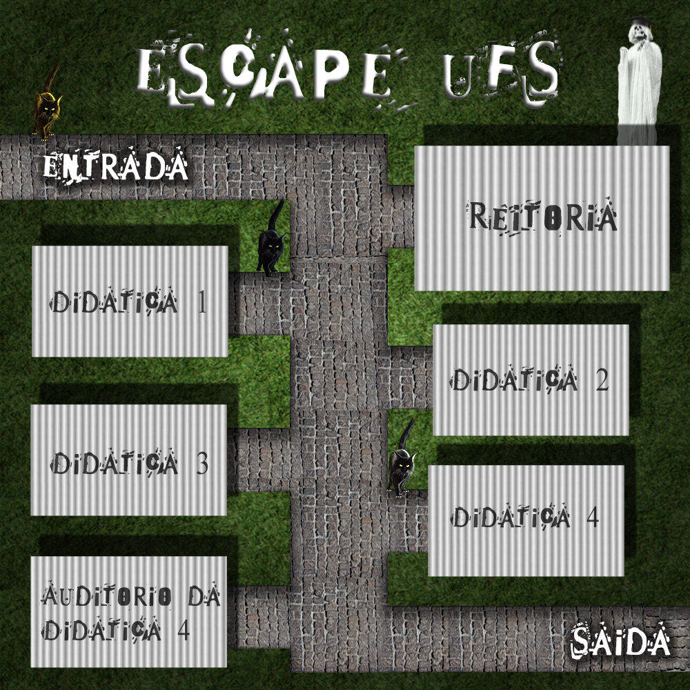

Repositório do jogo Escape UFS, baseado no jogo Zuul, disponibilizado no livro Objects First With Java: A Practical Introduction Using BlueJ. 

# Escape UFS

## Criadores
* Álvaro Luís Silva Peixoto
* Caio Vinicius da Cruz Coelho

## Como funciona o jogo?
* O jogo Escape UFS é baseado no jogo do tipo room to room do livro Objects First with Java. Nesse estilo de jogo, o player se desloca entre salas, afim de cumprir o objetivo determinado inicialmente. O Escape UFS é executado e jogado no terminal.

## Objetivos

* O objetivo geral do jogo é conseguir escapar do campus universitário.
* Para alcançar o objetivo geral, é necessário anteriormente encontrar o diploma, o qual pode estar escondido em qualquer uma das salas do jogo.
* Após encontrar o diploma, o jogador deve encontrar a saída antes que seja pego pelo fantasma do reitor e seja preso eternamente na UFS na forma de um gato.

## Mapa do jogo

